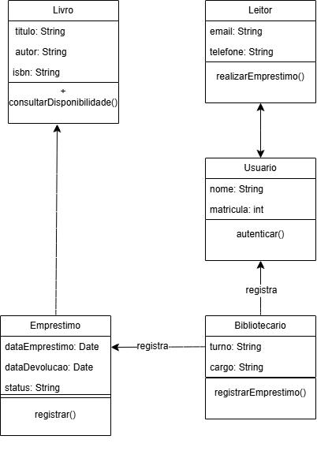

# Atividade 18 — Diagrama de Classes do BiblioTech
Nome: Gabriele Bueno Martins
Turma: 2º ano — Técnico em Informática

## Diagrama

## Por que estes números (associação Bibliotecario — Emprestimo)
- Perto de Emprestimo eu coloquei 0..* porque um bibliotecário registra vários empréstimos ao longo do turno.
- Perto de Bibliotecario eu coloquei 1 porque cada empréstimo é registrado por um só bibliotecário.

## Rastreabilidade (nível B)
- A operação realizarEmprestimo() da classe Leitor atende ao caso de uso Realizar empréstimo.

## Autoavaliação
- Conceito que pretendo: C
- Onde isso se prova no diagrama (classe / linha / número): na associação Bibliotecario — Emprestimo, com 1 do lado de Bibliotecario e 0..* do lado de Emprestimo.
